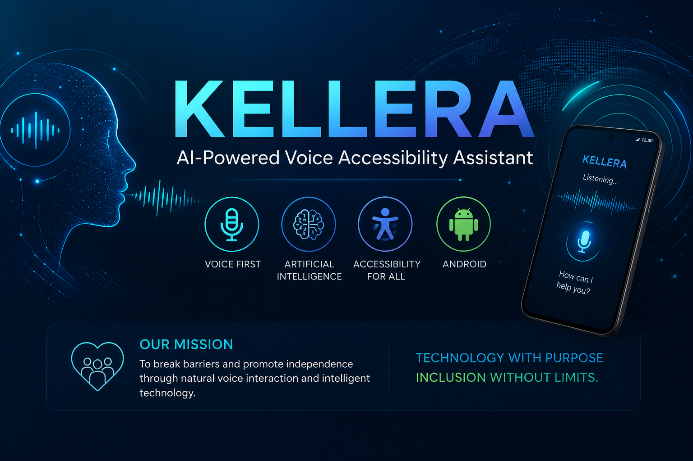

<p align="center">
  
</p>


# KELLERA

> **An AI-powered voice accessibility assistant that brings natural conversation, contextual understanding, and greater independence to Android users.**

---

## Vision

KELLERA is an accessibility platform designed to transform how people interact with smartphones.

Our mission is to improve autonomy, independence, and quality of life through artificial intelligence, making technology more human, accessible, and inclusive.

Originally inspired by the needs of blind users, KELLERA is evolving into an intelligent assistant capable of understanding context, interacting naturally through voice, and assisting users in everyday digital tasks.

---

## The Problem

Millions of people still face barriers when using smartphones.

Existing accessibility solutions often require gesture memorization, complex touch interactions, or extensive training.

KELLERA proposes a different approach:

**A natural conversation between the user and the smartphone.**

---

## The Solution

KELLERA combines voice interaction, Android accessibility technologies, contextual analysis, and artificial intelligence to create a hands-free user experience.

Instead of simply reading the screen, KELLERA aims to understand what is happening and guide the user naturally.

Example:

**User**

> Open Google.

**KELLERA**

> Google is open. You are on the home screen. The search bar is available. What would you like to search for?

This conversational workflow is the foundation of the project.

---

## Current MVP

The current MVP already demonstrates:

- Voice-first interaction
- Speech recognition
- Text-to-Speech
- Android Accessibility Service integration
- Device unlock detection
- Voice command processing
- Automatic Google launch
- Contextual voice guidance
- Accessibility overlay
- Continuous interaction flow

---

## Technology Stack

- Kotlin
- Android Studio
- Jetpack Compose
- Android Accessibility Service
- SpeechRecognizer API
- TextToSpeech API
- Git
- GitHub
- OpenAI GPT-5.6
- OpenAI Codex

---

## Project Architecture

```text
User
   │
   ▼
Speech Recognition
   │
   ▼
Command Processor
   │
   ▼
Context Analyzer
   │
   ▼
Accessibility Service
   │
   ▼
Android Applications
   │
   ▼
Voice Feedback
```

---

## AI-Assisted Development

Artificial intelligence played an important role during the development of KELLERA.

OpenAI GPT-5.6 and Codex were used to support:

- software architecture
- Kotlin implementation
- Android development
- debugging
- code review
- accessibility workflows
- documentation
- development planning

The project concept, product vision, feature prioritization, validation, testing, and long-term direction are defined by the project author.

---

## Roadmap

### Short-term

- Improve contextual understanding
- Enhance Accessibility Service
- Better screen interpretation
- Intelligent voice navigation

### Long-term

- Multi-application interaction
- AI-powered contextual reasoning
- Healthcare integration
- Assistive technologies for greater independence

---

## Why "KELLERA"?

The name **KELLERA** is inspired by **Helen Keller**, whose life demonstrated that barriers can be overcome through determination, education, and accessibility.

The project carries this inspiration forward by using technology to promote inclusion and independence.

---

## Repository Structure

```text
app/
 ├── accessibility/
 ├── context/
 ├── launcher/
 ├── model/
 ├── overlay/
 ├── speech/
 ├── voice/
 └── ui/
```

---

## Future Demonstrations

The repository will include:

- Screenshots
- Architecture diagrams
- Demonstration videos
- Development updates

---

## License

This project is currently available for research, educational, and evaluation purposes.

---

## Author

### Roberto Ribeiro da Silva

Systems Analysis and Development (ADS)

Founder of KELLERA

GitHub:
https://github.com/robertopub

LinkedIn:
https://www.linkedin.com/in/roberto-ribeiro-da-silva